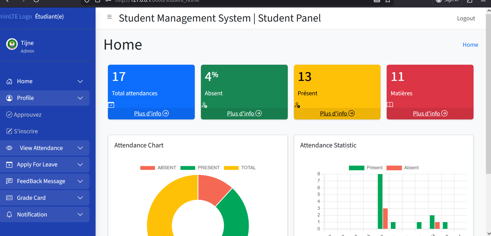

# 🎓 Student Management System (SMS)

Un **Système de Gestion des Étudiants** développé avec **Django**, permettant de digitaliser et centraliser la gestion académique d’un établissement scolaire.

Cette application propose **trois espaces utilisateurs** : Administrateur, Staff (Professeurs) et Étudiants.

---

## 🚀 Objectif du projet

Créer une application web intuitive pour gérer efficacement :

- Les étudiants
- Le personnel académique
- Les cours et matières
- Les présences et absences
- Les résultats académiques

Avec des **tableaux de bord interactifs** et des **statistiques visuelles** pour faciliter la prise de décision.

---

## 👥 Rôles utilisateurs

### 👨‍💼 Administrateur
- Gérer les étudiants et le personnel (Staff)
- Ajouter et gérer les cours et matières
- Valider les inscriptions et suivre les paiements
- Consulter des statistiques globales via des graphiques

### 👨‍🏫 Staff / Professeur
- Suivre les étudiants assignés
- Prendre et modifier les présences
- Gérer les demandes de congé
- Ajouter les notes et résultats
- Envoyer des notifications et feedbacks

### 🎓 Étudiant
- Consulter ses statistiques de présence
- Voir ses notes et résultats académiques
- Faire des demandes de congé
- Recevoir des notifications et messages
- Envoyer des feedbacks ou questions

---

## 📊 Fonctionnalités principales

- ✅ Authentification multi-rôles (Admin / Staff / Étudiant)
- ✅ Tableaux de bord dynamiques avec statistiques
- ✅ Graphiques de visualisation (présence, matières, notes, etc.)
- ✅ Gestion complète des présences
- ✅ Gestion des notes et résultats
- ✅ Système de notifications et feedback
- ✅ Base de données relationnelle PostgreSQL

---

## 🛠️ Technologies utilisées

### Backend
- Python
- Django
- PostgreSQL

### Frontend
- HTML
- CSS
- Bootstrap
- JavaScript
- Chart.js (visualisation des données)

---

## ⚙️ Installation du projet

```bash
# Cloner le projet
git clone https://github.com/SidyMohamed/nom-du-projet.git

# Aller dans le dossier du projet
cd nom-du-projet

# Créer un environnement virtuel
python -m venv venv

# Activer l’environnement
venv\Scripts\activate   # Windows
# source venv/bin/activate   # Linux / Mac

# Installer les dépendances
pip install -r requirements.txt

# Appliquer les migrations
python manage.py migrate

# Lancer le serveur
python manage.py runserver

## 📸 Aperçu du projet

### Tableau de bord Administrateur


### Espace Staff


### Espace Étudiant
